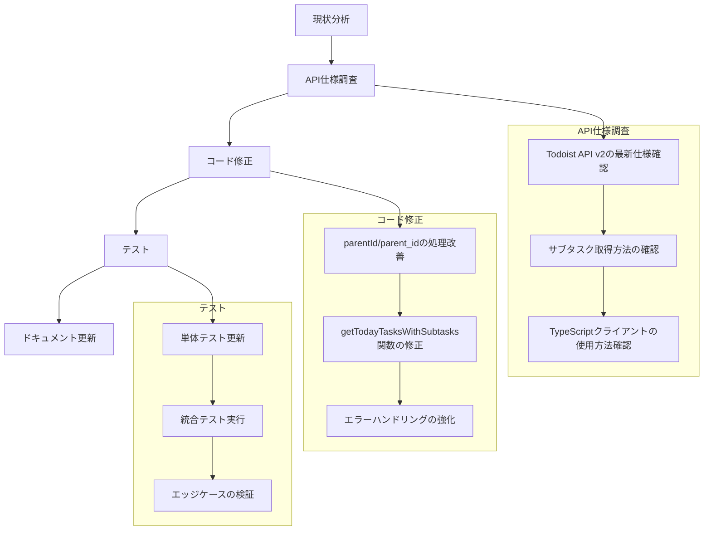

# Todoist API連携改善計画

*最終更新日: 2025-03-03*

## 概要

本ドキュメントは、TodoistのREST APIを使用して今日のタスクとそのサブタスクを取得する処理の改善計画を記述します。現在の実装では、APIの仕様変更に十分に対応できておらず、サブタスクが正しく取得できない問題が発生しています。

## 現状分析

現在のTodoistクライアント実装を調査した結果、以下の問題点が特定されました：

1. **API仕様の変更への対応不足**
   - 現在の実装では`parentId`と`parent_id`の両方を処理しようとしていますが、最新のTodoist API v2の仕様に完全に対応できていない
   - サブタスク取得処理が正しく機能していない状況

2. **サブタスク管理方法の変更**
   - Todoist APIでは以前は`indent`と`item_order`でサブタスク関係を管理していたが、現在は`parentId`（TypeScript）/`parent_id`（API応答）が推奨されている
   - 現在の実装がこの変更に対応できていない可能性がある

3. **APIレスポンス形式の変化**
   - APIのレスポンス形式が変更されている可能性があり、それに対応する必要がある

## API仕様調査結果

Todoist API v2およびTypeScriptクライアントライブラリの調査結果：

1. **サブタスク管理の変遷**
   - 旧API: `indent`と`item_order`でサブタスク関係を管理
   - 現API: `parentId`/`parent_id`で親子関係を明示的に管理
   - 注意点: `parentId`は読み取り専用プロパティとして扱われる場合がある

2. **TypeScriptクライアントの仕様**
   - `getTasks()`メソッドは様々なフィルタリングパラメータをサポート
   - タスクオブジェクトには`parentId`プロパティが含まれる
   - サブタスク取得は全タスクを取得して`parentId`でフィルタリングする方法が一般的

3. **レスポンス形式の多様性**
   - 配列形式: `[task1, task2, ...]`
   - オブジェクト形式（results）: `{ results: [task1, task2, ...] }`
   - オブジェクト形式（items）: `{ items: [task1, task2, ...] }`

## 改善計画



### 1. コード修正計画

#### 1.1 todoistClient.tsの修正

APIレスポンス形式の多様性に対応するため、以下のように修正します：

```typescript
// 修正前
const tasks = Array.isArray(response) ? response : (response.results || []);

// 修正後
const tasks = Array.isArray(response) ? response :
  (response.results || response.items || []);
```

この修正により、APIが返す可能性のある3つの形式（配列、resultsプロパティ、itemsプロパティ）すべてに対応します。

#### 1.2 サブタスク取得処理の改善

`getTodayTasksWithSubtasks`関数を以下のように修正します：

```typescript
/**
 * 今日期限のタスクとそのサブタスク（期限問わず）を取得
 * @param api - TodoistApiインスタンス
 * @returns 階層構造化された今日期限のタスクとそのサブタスクの配列
 */
export async function getTodayTasksWithSubtasks(
  api: TodoistApi | any
): Promise<HierarchicalTask[]> {
  try {
    console.log('getTodayTasksWithSubtasks: 今日期限のタスクとそのサブタスクを取得します');

    // 全タスクを一度に取得（最適化）
    const allTasks = await getTasks(api);
    console.log(`全タスク数: ${allTasks.length}`);

    // 今日期限のタスクをフィルタリング
    const today = new Date().toISOString().split('T')[0];
    const todayTasks = allTasks.filter(task =>
      task.due?.date === today && !task.isCompleted
    );
    console.log(`今日期限のタスク数: ${todayTasks.length}`);

    // 今日期限のタスクがない場合は空配列を返す
    if (todayTasks.length === 0) {
      console.log('今日期限のタスクが見つかりませんでした');
      return [];
    }

    // 今日期限のタスクのIDを抽出
    const todayTaskIds = todayTasks.map(task => task.id);
    console.log(`今日期限のタスクID: ${todayTaskIds.join(', ')}`);

    // 関連タスク（今日のタスクとそのサブタスク）を収集
    const relevantTasks: TodoistTask[] = [...todayTasks];

    // サブタスクを検索（parentIdまたはparent_idを使用）
    for (const task of allTasks) {
      // parentIdとparent_idの両方に対応
      const parentId = task.parentId || task.parent_id;

      if (parentId && todayTaskIds.includes(parentId)) {
        console.log(`サブタスク候補: ${task.content} (ID: ${task.id}, 親ID: ${parentId})`);

        // 重複チェック
        if (!relevantTasks.some(t => t.id === task.id)) {
          // parentIdとparent_idの統一（内部的にはparentIdを使用）
          const normalizedTask = {
            ...task,
            parentId: parentId
          };
          relevantTasks.push(normalizedTask);
          console.log(`サブタスクを追加: ${task.content} (ID: ${task.id}, 親ID: ${parentId})`);
        }
      }
    }

    console.log(`関連タスク数: ${relevantTasks.length}`);

    // タスクを階層構造化
    return buildTaskHierarchy(relevantTasks);
  } catch (error) {
    console.error('getTodayTasksWithSubtasks: エラーが発生しました', error);
    throw error;
  }
}
```

#### 1.3 階層構造化処理の改善

`buildTaskHierarchy`関数を以下のように修正します：

```typescript
/**
 * タスク配列を階層構造に変換
 * @param tasks - フラットなタスク配列
 * @returns 階層構造化されたタスク配列
 */
export function buildTaskHierarchy(tasks: TodoistTask[]): HierarchicalTask[] {
  // タスクをIDでマップ化
  const taskMap = new Map<string, HierarchicalTask>();

  // 基本的なタスク構造を作成してマップに追加
  tasks.forEach(task => {
    // parentIdとparent_idの両方に対応
    const parentId = task.parentId || task.parent_id;

    const structuredTask: HierarchicalTask = {
      ...task,
      subTasks: [],
      isSubTask: !!parentId,
      level: 0
    };
    taskMap.set(task.id, structuredTask);
  });

  // ルートタスク配列
  const rootTasks: HierarchicalTask[] = [];

  // 親子関係を構築
  tasks.forEach(task => {
    const structuredTask = taskMap.get(task.id);

    if (structuredTask) {
      // parentIdとparent_idの両方に対応
      const parentId = task.parentId || task.parent_id;

      if (parentId && taskMap.has(parentId)) {
        // 親タスクが存在する場合、サブタスクとして追加
        const parentTask = taskMap.get(parentId);
        if (parentTask) {
          parentTask.subTasks.push(structuredTask);
          structuredTask.level = parentTask.level + 1;
          structuredTask.isSubTask = true;
        }
      } else {
        // 親タスクがない場合はルートタスク
        rootTasks.push(structuredTask);
      }
    }
  });

  return rootTasks;
}
```

### 2. テスト計画

#### 2.1 単体テスト

`todoistClient.test.ts`を更新して、以下のテストケースを追加します：

1. **APIレスポンス形式のテスト**
   - 配列形式のレスポンス
   - `results`プロパティを持つオブジェクト形式のレスポンス
   - `items`プロパティを持つオブジェクト形式のレスポンス

2. **サブタスク関係のテスト**
   - `parentId`を持つサブタスク
   - `parent_id`を持つサブタスク
   - 多階層のサブタスク（親→子→孫）

3. **エラーケースのテスト**
   - API通信エラー
   - 不正なレスポンス形式

#### 2.2 統合テスト

`todoistClient.integration.test.ts`を更新して、以下のテストケースを追加します：

1. **実際のAPIを使用したサブタスク取得テスト**
   - 今日期限の親タスクとそのサブタスクを作成
   - `getTodayTasksWithSubtasks`関数で取得
   - 階層構造が正しいことを検証

2. **エッジケースのテスト**
   - サブタスクが存在しない場合
   - 多階層のサブタスク（最大4階層）
   - 期限のないサブタスク

### 3. ドキュメント更新

#### 3.1 API仕様ドキュメントの更新

`docs/api/todoist-client.md`を更新して、以下の内容を追加します：

1. **サブタスク取得の仕様**
   - `parentId`/`parent_id`の扱い
   - APIレスポンス形式の多様性
   - 階層構造の構築方法

2. **使用例の追加**
   - 今日期限のタスクとサブタスクの取得例
   - サブタスクのフィルタリング例

#### 3.2 実装状況ドキュメントの更新

`docs/setup/implementation-status.md`を更新して、サブタスク取得機能の改善を記録します。

## 実装の注意点

1. **互換性の確保**
   - 異なるバージョンのTodoist APIに対応するため、`parentId`と`parent_id`の両方をサポート
   - APIレスポンス形式の多様性に対応

2. **エラーハンドリング**
   - API通信エラーの適切な処理
   - レスポンス形式の変更に対するロバストな処理

3. **パフォーマンス**
   - 不要なAPI呼び出しを減らすため、一度の呼び出しで全タスクを取得
   - 大量のタスクがある場合の処理効率の考慮

4. **デバッグ支援**
   - 適切なログ出力による問題診断の容易化
   - レスポンス構造の詳細なロギング

## 今後の課題

1. **ページネーション対応**
   - 大量のタスクがある場合のページネーション処理

2. **キャッシュ機構**
   - 頻繁なAPI呼び出しを減らすためのキャッシュ実装

3. **リアルタイム更新**
   - Webhookを活用したリアルタイム更新機能

## 参考資料

1. [Todoist REST API v2 ドキュメント](https://developer.todoist.com/rest/v2/)
2. [@doist/todoist-api-typescript ライブラリ](https://github.com/Doist/todoist-api-typescript)
3. [Todoist API サブタスク管理の変遷](https://github.com/Doist/todoist-python/issues/24)